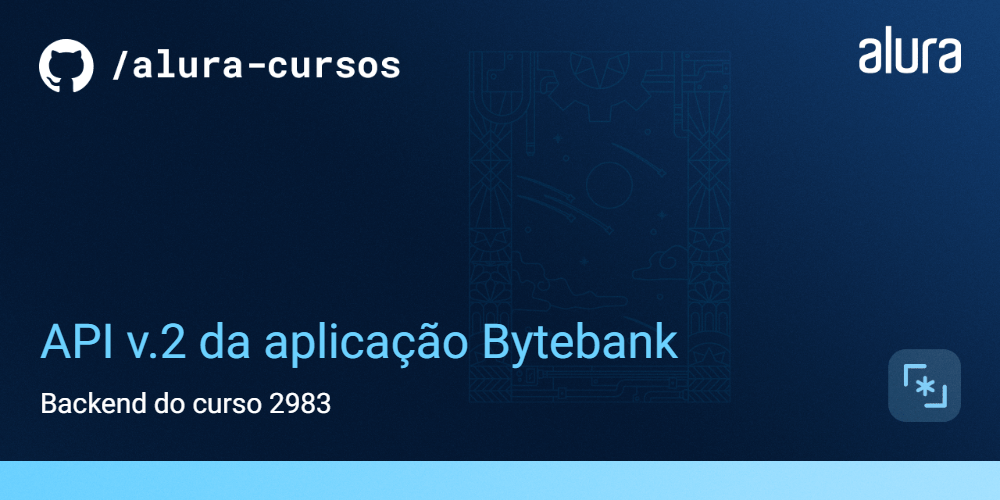

# Bytebank

O Bytebank é um MVP de banco digital que ainda está em fase de desenvolvimento. Esta API foi desenvolvida com o objetivo de facilitar os testes de algumas partes da aplicação e testar novas features. 

# lowDB + JWT Auth

Essa é ma API Rest mockada, utilizando [lowDB](https://github.com/typicode/lowdb) e JWT.

## 🛠️ Instalação

```bash
$ npm install
$ npm run dev
```

## 🛠️ Como se registrar?

Você pode se registrar efetuando uma requisição post para:

```
POST http://localhost:8000/users/register
```

Com os seguintes dados por exemplo:

```
{
    "nome": "neilton seguins",
    "email": "neilton@alura.com.br",
    "senha": "123456",
}
```

O e-mail é um campo único e usuários com e-mails duplicados não serão persistidos.

## 🛠️ Como fazer login?

Você pode fazer login efetuando uma requisição post para:

```
POST http://localhost:8000/users/login
```

Com os seguintes dados:

```
{
  "email": "neilton@alura.com.br",
  "senha":"123456"
}
```

Você vai receber um token no seguinte formato:

```
{
   "access_token": "<ACCESS_TOKEN>",
   "user": { ... dados do usuário ... }
}
```

## Autenticar próximas requests?

E então, adicionar este mesmo token ao header das próximas requisições:

```
Authorization: Bearer <ACCESS_TOKEN>
```

## 📚 Mais informações do curso

O Bytebank é um projeto utilizado durante toda a formação de React: Melhore suas aplicações com testes automatizados, e essa API será utilizada em alguns cursos :)
